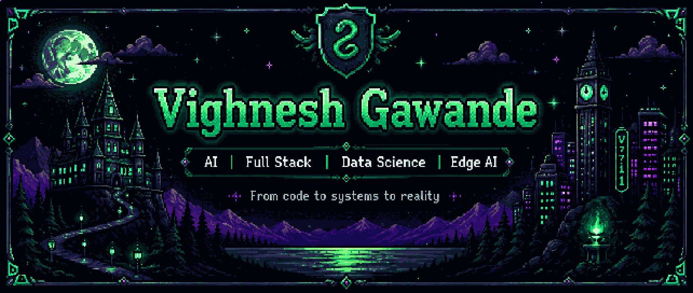

<!-- Animated wave header -->

<div align="center">



<br/><br/>


</div>


<br/>

<a href="https://linkedin.com/in/vighnesh-gawande"></a>
<a href="mailto:vighneshgawande@gmail.com"></a>
<a href="https://github.com/Vighnesh7711"></a>

</div>

<br/>


## 🧭 About Me

```yaml
name: Vighnesh Vikas Gawande
role: Information Technology Undergraduate
university: Finolex Academy of Management and Technology, Ratnagiri (Expected 2027)
cgpa: 7.71 / 10.0
focus:
  - Full-Stack Web Development (React, Node.js, Express, Flask)
  - AI/ML Product Engineering (NLP, Regression, XGBoost, Scikit-learn)
  - Agentic AI & Generative AI Systems (AICTE x Lenovo LEAP Scholar)
  - Embedded Systems & Edge AI (ESP32, Arduino Uno, YOLOv8-nano, TinyML)
  - Workflow Automation (n8n)
currently_building: "Smartphone-Centric Hybrid V2V Anomaly Detection & Communication System"
location: Sindhudurg, Maharashtra, India
```

- 🔭 Currently engineering a **4-layer adaptive V2V communication stack** (ESP-NOW, Li-Fi, Infrared, GSM) with real-time edge hazard detection.
- 🧠 Scholar in Anthropic-era Generative AI & Agentic Systems Engineering — **AICTE x Lenovo LEAP NextGen Program**.
- 🛠️ Building recruitment AI, price-prediction pipelines, and automation-first tooling.
- 🌱 Deepening expertise in **TinyML + embedded AI** for real-world hardware deployment.
- ⚡ Fun fact: I like turning crazy ideas into working prototypes — especially when they involve AI, hardware, and a little bit of magic.
<br/>


<br><br>

<div align="center">

</div>

## 🛠️ Tech Stack

<table>
<tr>
<td valign="top" width="62%">

**Languages**
<br/>


**Frameworks & Web**
<br/>


**AI / ML & Data**
<br/>


**Backend & Databases**
<br/>


**Embedded / IoT / Edge AI**
<br/>


**Dev Tools & Automation**
<br/>


</td>

<td width="38%" align="center" valign="middle">
  
</td>

</tr>
</table>
<br/>


<br/>

<div align="center">


*"Thanks for stopping by — always open to collaborating on AI, embedded systems, or automation projects."*


<p align="center">
  
</p>
